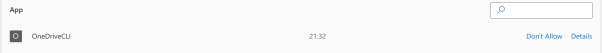

# OneDriveCLI for Linux
- [OneDriveCLI for Linux](#onedrivecli-for-linux)
  - [Introduction](#introduction)
  - [Installation](#installation)
  - [Initialisation](#initialisation)
    - [Revoking App Access](#revoking-app-access)
  - [Instructions](#instructions)
    - [Initialise](#initialise)
    - [Get Current Working Directory](#get-current-working-directory)
    - [Change Directory](#change-directory)
    - [List Items in Current Working Directory](#list-items-in-current-working-directory)
    - [Make New Directory](#make-new-directory)
    - [Remove/Delete an Item](#removedelete-an-item)
    - [Get/Download a File](#getdownload-a-file)
    - [Put/Upload a File](#putupload-a-file)
    - [Enable Debug Traces](#enable-debug-traces)
    - [Disable Debug Traces](#disable-debug-traces)

## Introduction

OneDriveCLI for Linux provides a simple command-line interface into consumer Microsoft OneDrives. It permits directory navigation, downloading and uploading files, creating directories and deleting items (moves them to the OneDrive recycle bin).

Currently, only desktop Linux versions are supported as the initialisation process requires a default browser which is used to enter Microsoft OneDrive account details.

The application is written in Python. Source is distributed under GPL.

## Installation

The application can be built and installed by cloning this repo then running `make install`:

Note the `--recurse` option in the `clone` command below.

```
➜ git clone --recurse git@github.com:chris-j-akers/OneDriveCLI.git
➜ make install
```
Initialisation creates a sub-directory called `OneDriveCLI` in `~/.config` where it stores a *sqlite3* database called `settings.db`. This database contains session-state and refresh tokens required by Microsoft Graph.

Once the installation process has completed successfully the cloned repo can be deleted. A version installable from PyPi will shortly be available.

## Initialisation

Before first use, you must register the app with your Microsoft OneDrive account using the following command:

```
➜ odc init
```
This will open your default web-browser and present you with the Microsoft OneDrive logon page. You will need to logon and accept the access requirements for the application.


### Revoking App Access

Access can be revoked at any time by logging in to your Microsoft 365 Account and selecting:

`My Account` -> `Privacy` -> `App Access`.

You should see OneDriveCLI in the list of apps. Select `Don't Allow` to revoke.



Alternatively, click `Details` and select `Stop Sharing`


## Instructions

Running `odc` without parameters will present a brief summary of the available commands.

```
➜ odc 
----------------------------------------------------------------------------------------------
OneDriveCLI | (C) 2024 Chris Akers | https://github.com/chris-j-akers | https://blog.cakers.io
----------------------------------------------------------------------------------------------
initialise                      : 'odc init'
change directory                : 'odc cd <dir_name>'
list items in current directory : 'odc ls'
get current directory           : 'odc pwd'
make new directory              : 'odc mkdir <remote_path>'
delete item                     : 'odc rm <remote_path>'
get file from current directory : 'odc get <remote_path> [local_path]'
put file to current directory   : 'odc put <local_path> [remote_path]'
enable debug traces             : 'odc debug-on'
disable debug traces            : 'odc debug-off'

* <> = required parameter, [] = optional parameter
----------------------------------------------------------------------------------------------
```

### Initialise

`odc init`

See Initialisation section, above. `odc init` will initialise OneDriveCLI for use with your personal OneDrive.

The application will open your default browser at the Microsoft 365 Logon page where you will need to log in to your Microsoft account and permit access to OneDrive.

Initialisation creates a sub-directory called `OneDriveCLI` in `~/.config` where it stores a *sqlite3* database called `settings.db`. This database contains session-state and refresh tokens required by Microsoft Graph.

### Get Current Working Directory

`odc pwd`

Prints the current working directory.

```
➜ odc pwd
/drives/539fb3f9a5fe3189/root:/tech-books
```

### Change Directory

`odc cd <new_dir>`

Change current working directory to one specified by the parameter.

Standard shortcuts can be used, here such as `./` for current directory and `..` for parent directory. 

Using `cd` with no `<new_dir>` parameter changes the directory to `root`.

```
➜ odc cd ./tech-books
/drives/539fb3f9a5fe3189/root:/tech-books
➜ odc cd
/drives/539fb3f9a5fe3189/root:/
```
### List Items in Current Working Directory

`ls`

List all items in current working directory.

```
➜ odc ls
d  https://1drv.ms/f/s!AIkx_qX5s59TiIhJ  Chris Akers  2023-06-08 12:30:54  Chris Akers  2023-06-08 12:29:27  12340440  _backup                                                                 
d  https://1drv.ms/f/s!AIkx_qX5s59ThJAC  Chris Akers  2021-12-20 10:16:32  Chris Akers  2021-12-20 10:16:31   4960207  Learning Public Key Infrastructure form Scratch                         
d  https://1drv.ms/f/s!AIkx_qX5s59TiK4V  Chris Akers  2024-01-31 16:15:55  Chris Akers  2024-01-31 16:15:54  37021051  reverse-engineering-for-beginners                                       
f  https://1drv.ms/b/s!AIkx_qX5s59Tg_8x  Chris Akers  1970-01-01 00:00:00  Chris Akers  2021-06-02 14:17:27   3543397  8080 Programmers Manual.pdf                                             
f  https://1drv.ms/b/s!AIkx_qX5s59TiJsy  Chris Akers  2023-05-29 10:07:16  Chris Akers  2023-05-29 10:07:16   3643165  Andrew S. Tanenbaum - Operating Systems. Design and Implementation.pdf  
f  https://1drv.ms/b/s!AIkx_qX5s59Th-RA  Chris Akers  2022-08-22 15:44:56  Chris Akers  2022-08-22 15:44:56    620127  AWS_Interview_Questions_Answers__1661183088.pdf

/drives/539fb3f9a5fe3189/root:/
```

Output is split into the eight fields described below.

| Field              | Description                                                                |
|--------------------|----------------------------------------------------------------------------|
| Item Type          | d = directory, f = file                                                    |
| URL                | URL for item. Can be used to access the item directly in a browser         |
| Creator            | Name of file creator                                                       |
| Create Date        | Date the file was created                                                  |
| Last Modifier      | Name of last person to modify the file                                     |
| Last Modified Date | Date the file was last modified                                            |
| Size               | Size of file in bytes                                                      |
| Name               | Filename                                                                   |

### Make New Directory

`odc mkdir <remote_path>`

Make a new directory.

```
➜ odc mkdir ./test-dir
created: /tech-books/test-dir
➜ odc cd test-dir
/drives/539fb3f9a5fe3189/root:/tech-books/test-dir
➜ odc mkdir ../test-dir-2
created: /tech-books/test-dir-2
➜ odc cd ../test-dir-2
/drives/539fb3f9a5fe3189/root:/tech-books/test-dir-2
```
### Remove/Delete an Item

`odc rm <remote_path>`

Either a file or a directory can be specified as the `<remote_path>`

This actually moves the item to the OneDrive recycling bin, it doesn't delete it permanently.

```
➜ odc rm ./test-dir
Are you sure you want to move item /tech-books/test-dir to the recycle bin? (Y/N)Y
deleted: /tech-books/test-dir
```
### Get/Download a File

`odc get <remote_path> [local_path]`

Download a file to your local host. If no local path is specified, will download to current local directory.

```
➜ odc get ./tech-books/reverse-engineering-for-beginners/october-2023/RE4B-EN-October-2023.pdf
Downloading [RE4B-EN-October-2023.pdf] to [./]
..Done
➜ ls -l RE4*
-rw-rw-r-- 1 cakers cakers 12340127 Apr 10 21:18 RE4B-EN-October-2023.pdf
```

### Put/Upload a File

`odc put <local_path> [remote_path]`

Upload a file from your local host. If no remote path is specified, will upload to the current OneDrive directory.

```
➜ odc put ./RE4B-EN-October-2023.pdf ./books
Uploading [./RE4B-EN-October-2023.pdf] (12340127 bytes)
..Done
➜ odc cd books
/drives/539fb3f9a5fe3189/root:/books
➜ odc ls
f  https://1drv.ms/b/s!AIkx_qX5s59TiLcv  Chris Akers  2024-04-10 20:21:02  Chris Akers  2024-04-10 20:21:02  12340127  RE4B-EN-October-2023.pdf  
```

### Enable Debug Traces

`odc debug-on`

Enables DEBUG trace statements.

```
➜ odc debug-on
DEBUG:OneDriveCLI.OneDriveCLI.OneDriveCLI:updating value "debug_on" to "true" in settings db
➜ odc ls
DEBUG:OneDriveCLI.OneDriveCLI.OneDriveCLI:updating value "debug_on" to "true" in settings db
DEBUG:OneDriveCLI.OneDriveCLI.OneDriveCLI:drive id set to "539fb3f9a5fe3189" (if this is "None" then DB is new and Initialise() needs to be run)
DEBUG:OneDriveCLI.OneDriveCLI.OneDriveCLI:sending get request to /drives/539fb3f9a5fe3189/root:/books:/children
DEBUG:OneDriveTokenHandler.OneDriveTokenHandler.OneDriveTokenHandler:no valid cached token, checking for refresh token
DEBUG:OneDriveTokenHandler.OneDriveTokenHandler.OneDriveTokenHandler:Refresh token found in db
...
...
...
```

### Disable Debug Traces

`odc debug-off`

Disables DEBUG trace statements.

```
➜ odc debug-off
```